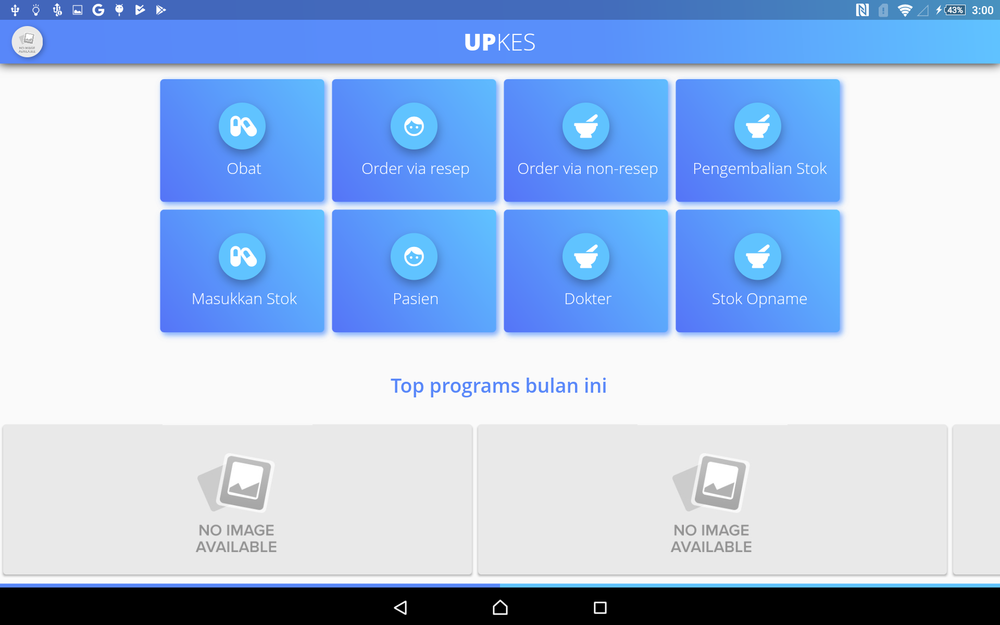

# Beranda

Dalam tampilan awal memiliki banyak menu dan submenu. Berikut adalah fitur-fitur dalam tampilan awal

1. Menu Obat    
    Menu untuk melihat daftar obat dan menambah daftar obat.

2. Menu Order via resep     
     Order Via ini,obat yang ditentukan berdasarkan resep dokter.

3. Menu Order via non resep
    Order berdasarkan obat yang di butuhkan tampa resep dari dokter

4. Pengembalian Stok    
    Menu ini berfungsi untuk mengembalikan obat yang akan kadaluarsa.

5. Masukan Stok     
    Menu ini berfungsi untuk manambahkan stok obat.

6. Pasien   
     Menu pasies berfunsi untuk melihat pasien yang sudah terdaftar dan juga bisa untuk mendafarkan pasien.

7. Dokter   
    Menu Dokter berfungsi untuk Melihat dokter yang ada dan menambahkan dokter.

8. Stok Opname  
    Menu yang berfunsi untuk melihat stok obat berdasarkan Ruangan dan tanggal.

 