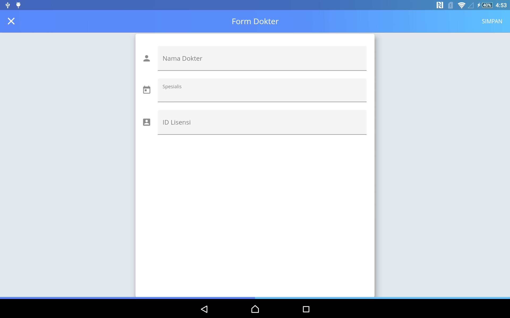

#Dokter

pada menu dokter berguna untuk melihat dokter yang ada,menambah dokter,mengedit data dokter,dan menghapus dokter.

Keterangan :
* klik tombol tambah untuk menambah dokter.

* klik tombol yang diberi tanda lingkaran untuk mengedit dan menghapus.setelah itu akan masuk pada halaman berikut.

 * jika ingin mengedit klik sunting setelah itu akan maksud pada halaman sebagai berikut.
 
 setelah mengedit klik simpan.
 * jika ingin menghapus klikl hapus,setelah itu akan ada pesan sebagai berikut.
  
  jika anda yakin menghapus klik **ya,hapus** jika tidak yakin klik **batal**.