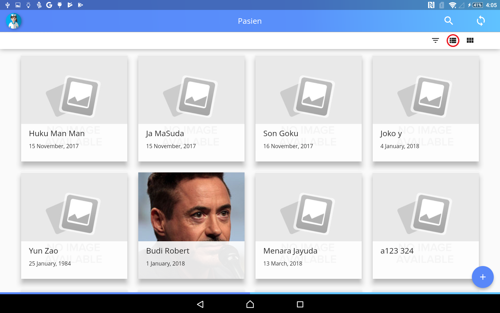
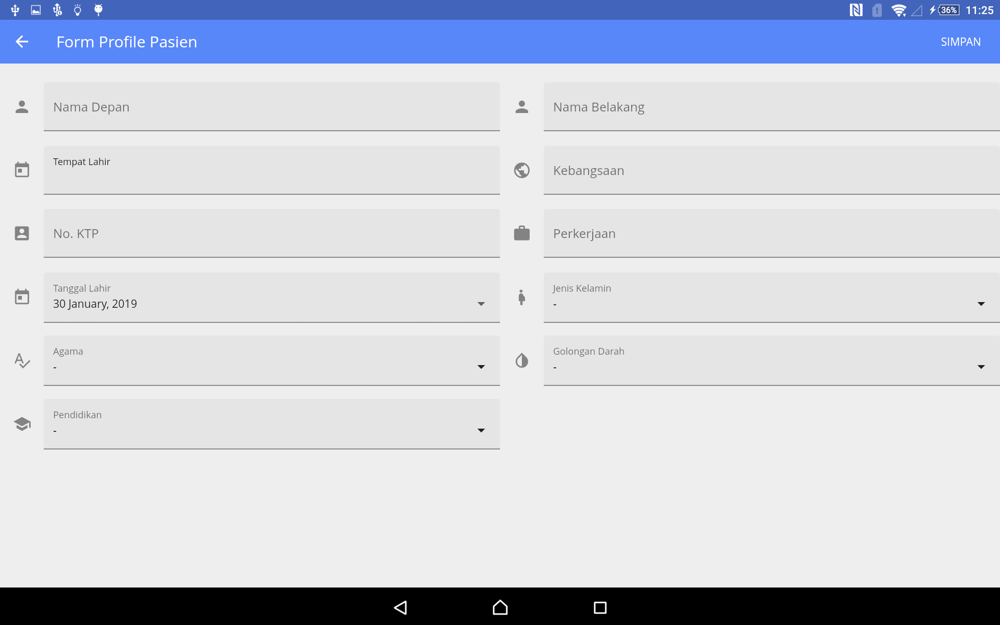

# Menu Pasien
Menu ini berfungsi untuk melihat pasien yang  ada dan juga merubah atau menghapus pasien.

* jika ingin menambah pasien klik tombol tambah,yang berada dipojok kanan bawah,Setelah mengklik akan masuk pada halaman berikut.

isi semua form yang tersedia,setelah semua terisi klik simpan untuk menyimpan data pasien.
