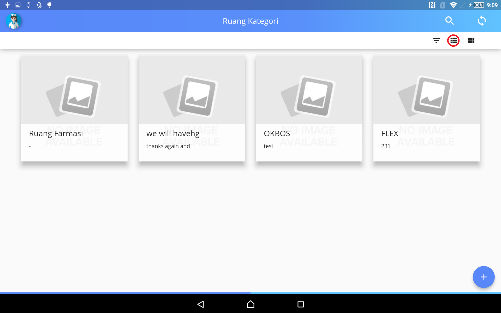
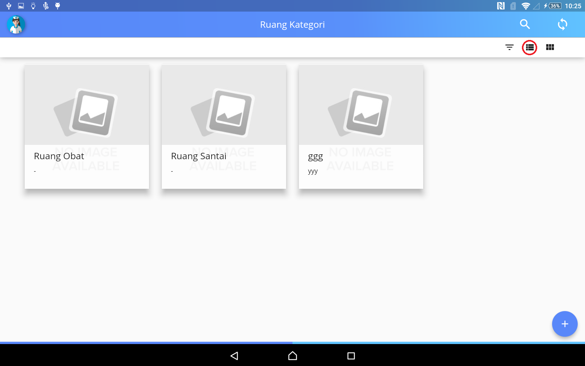
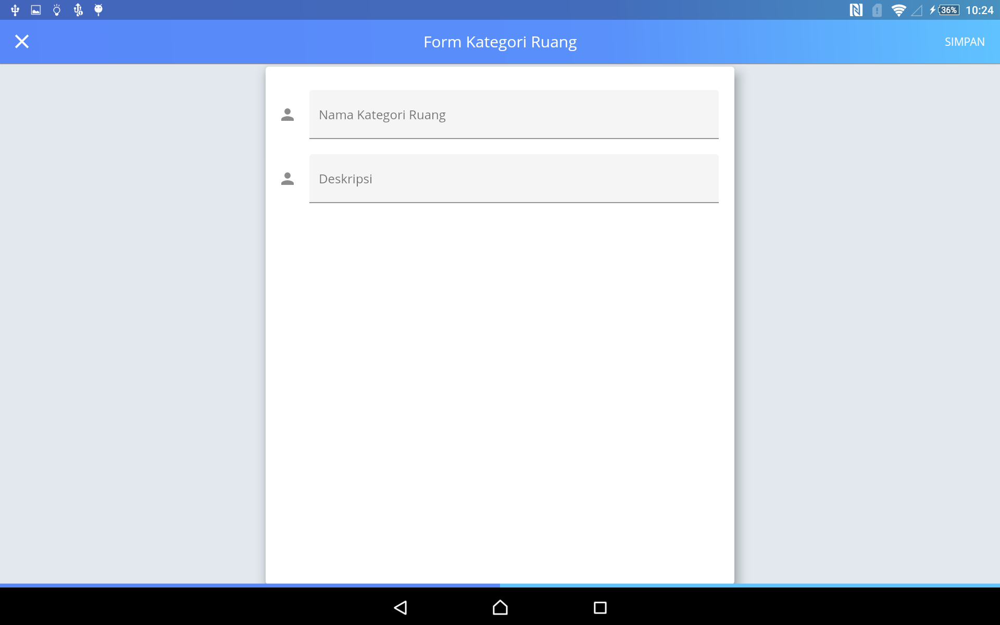

# Ruang

Pada menu Ruang/Room dikelompokan berdasarkan kategori ruangan, pada halaman pertama terdapa kategori ruangan seperti gambar di atas, kemudian klik tombol yang di beri tanda merah untuk melihat atau mengatur ruangan di kategori tersebut, seperti gambar di bawah

tombol yang bertanda merah pada gambar di atas berfungsi untuk menghapus atau merubah kategori ruangan 

## Menambah  kategori ruangan 
Untuk menambah kategori ruangan langkah pertama klik tombol "+" kemudian akan di tampilkan form sebagai berikut 

pada form pertama di isi untuk memberi nama ruagan yang aka di tambahkan pada form kedua untuk menambahkan deskripsi pada ruangan yang akan di tambahkan.