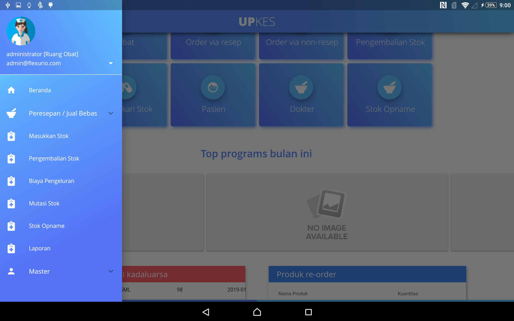

# HOME

Di dalam sistem informasi klinik upkes ini memiliki banyak menu-menu dan submenu, Tampilan awal ini berada ditab home. Berikut fitur dari sistem informasi klinik upkes.

## Beranda
Menu ini berfungsi untuk menampilkan keseluruhan informasi dari klinik upkes.

## Peresepan / Jual Bebas
pada menu ini memiliki dua submenu "Peresepan" dan "Jual Bebas" fungsi dari submenu "Peresepan " adalah untuk menampilkan data obat dari resep dokter sedangkan pada submenu "Jual Bebas" menampilkan semua data obat tampa melalui resep dokter. 

## Masukan Stok
menu ini berfungsi menambahkan stok obat yang baru atau bisa juga untuk menambahkan stok obat yang sudah ada.

## Pengembalian Stok
dalam menu ini berfungsi untuk mengembalikan obat yang akan kadaluarsa kepada supplier.

## Biaya Pengeluaran
untuk menu ini memiliki fungsi untuk melihat data biaya yang sudah dikeluarkan.

## Mutasi Stok

## Stok Opname
fitur ini berfungsi untuk memudahkan pencarian obat yang ada berdasarkan ruang obat dan periode tanggal masuk obat tersebut.

## Laporan

## Master
didalam menu master terdapat beberapa submenu,
berikut adalah firur submenu yang ada dalam menu master.