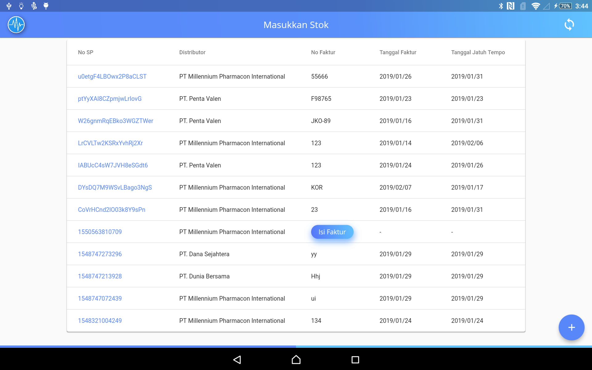

# Masukan stok
## Stok Awal

1.  Jika ingin menambah stok obat perlu memilih ruang.   
**Cara Memilih Ruang :**
    * klik tombol perawat.
    * pilih penganturan akun.
    * lalu pilih menu ruang.
    * pilih salah satu ruang.

2. Setelah Masukan Kehalaman Masukan Stok Klik Tombol **+**. 
 

3. Klik Tombol Stok Awal.

4. sesudah itu akan masuk pada halaman selanjutnya,lalu isi semua inputan dan setelah inputan terisi klik tombol **+**.

## Distributor dan Nomor Faktur

 
Isi data Distributor dan Nomor Faktur

pilih tanggal Faktur dan tanggal jatuh tempo lalu klik tombol "Berikutnya"

   
Isi semua inputan lalu klik tombol bertanda **+**, untuk menghapus dan mengedit data klik item pada obat.

## Distributor
   
Cara yang satu ini cukup isi pada inputan Distributor lalu klik tombol "Berikutnya"

  
maka akan masuk pada halaman seperti di atas, isi inputan lalu klik tombol "**+**" setelah itu klik tombol Simpan

## Isi No Faktur

klik tombol isi no faktur.

isi no faktur setelah  itu klik tombol berikutnya.

isi semua inputan yang tersedia lalu klik tombol **+**,jika ingin mengedit klik item yang berada di form obat.