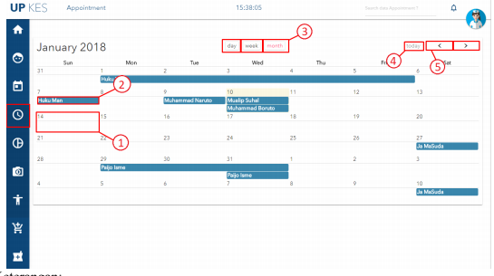

## Appointments

keterangan :
1. Klik salah satu tanggal untuk membuat schedule baru.
2. schedule yang telah terdaftar,Klik untuk melihat detail schedule tersebut.
3. Tombol untuk menggati tampilan (har, minggu, dan bulan) kalender.
4. Tombol untuk menfokuskan kehari.
5. Tombol untuk pindah halaman kalender.
