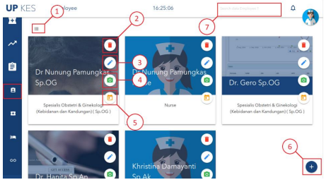

# MENU MARKDOWN
## Employee

Keterangan:
1. Tombol untuk menggati tampilan (table atau kartu). 
2. Tombol untuk menghapus employee.
3. Tombol untuk mengubah employee.
4. Tombol untuk menggugah foto employee.
5. Tombol untuk membuat jadwal employee.
6. Tombol untuk menambah emplyee baru.
7. Textbox untuk mencari data employee,berdasarkan nama employee
            
            
