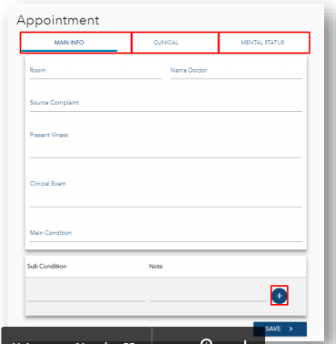

* General checkup
    
    pada type Generalcheckup terdapat 3 tab untuk mengisi data sesuai judul tab tersebut.Di tab "MAIN INFO" terdapat bidang sub condition,bidang tersebut biasa diisi lebih dari 1 data,dengan cara klk tombol "**+**" untuk menambah kondisi lain.
    