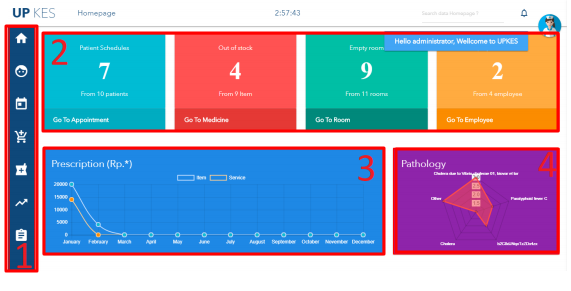

## Home

Dalam tampilan awal terdapat beberapa diagram yang menunjukan beberapa
informasi singkat, yaitu :
1. Menu
2. Infromasi saat ini
3. Diagram pendapatan dari peresepan (obat dan pelayanan)
4. Diagram penyakit yang sering dialami pasient

Di dalam sistem informasi klinik upkes ini memiliki banyak menu-menu dan
submenu. Tampilan awal tadi berada ditab Home. Berikut adalah fitur-fitur lain
dari sistem informasi klinik upkes.