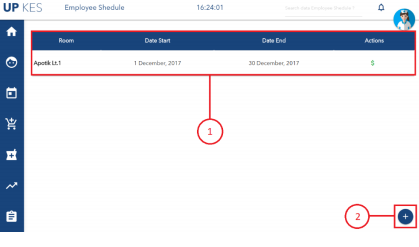

Untuk membuat jadwal employee, klik tombol “KALENDAR” yang berwarna
orange, kemudian akan dialihkan ke halaman Employe Schedule seperti gambar di bawah
ini. Setelah itu klik tombol “+” yang berwarna biru untuk membuat jadwal.
## jadwal employee

Keterangan :
1. Data jadwal yang telah dibuat.
2. Tombol untuk menambah jadwal employeebaru.