# Patients
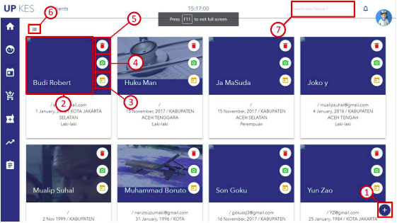

Keterangan :

1. Tombol untuk menambah pasien
2. Klik foto untuk melihat data pasien.
3. Tombol untuk membuat jadwal pasien medical report.
4. Tombol untuk menggugah foto pasien.
5. Tombol untuk menghapus pasien.
6. Tombol untuk mengganti tampilan ( tabel atau kartu ) data.
7. Textbox untuk mecari data pasien, bedasarkan nama pasien.  

## Tambah Pasien Baru
klik logo seperti gambar di atas (posisinya dipojok kanan bawah), lalu akan
muncul form.

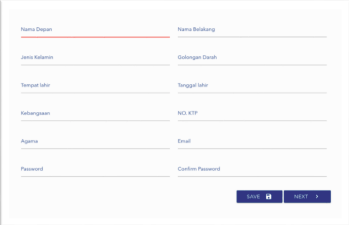

Form pertama bertujuan untuk mengisi biodata pasien. Tombol “NEXT”
untuk mengisi form selanjutnya, sedangkan tombol “SAVE” untuk langsung
menyimpan data tanpa harus mengisi form lain. Jika klik “NEXT” maka di harus
beberapa mengisi form berikut.

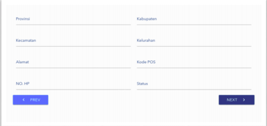

Tombol “PREV” untuk kembali ke form sebelumnya.

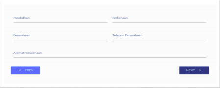

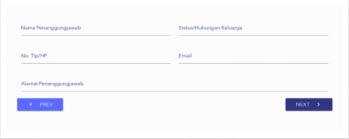

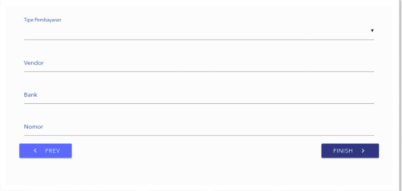

Pada form terakhir terdapat kolom “Tipe Pembayaran” dan pada kolom
tersebut terdapat beberapa pilihan, yaitu Cash, Asuransi, Kredit. Ditiap-tiap
pilihan tipe pembayaran terdapat perbedaan tampilan form. Berikut merupakan
perbedaannya.

* #### CASH

    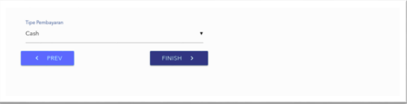

* ### Asuransi

    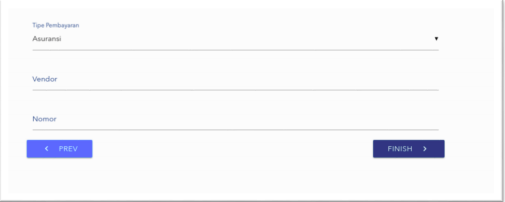

* ### Kredit

    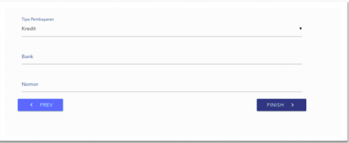

Setelah itu klik “FINISH”, lalu akan muncul notifikasi sukses yang berarti data
berhasil disimpan.

## Foto

Klik tombol kamera hijau, untuk menambah ataupun menggati foto pasien, jika diklik
maka akan muncul form seperti gambar di bawah ini.

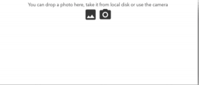

Pada form tersebut terdapat 2 pilihan untuk mengupload foto. Yang pertama
mengupload foto dari PC atau Galeri sedangkan yang kedua bergambar foto yang
berarti foto langsung diambil dari kamera.

Setelah memilih foto akan lanjut untuk mengcrop foto. Seperti contoh
gambar dibawah.

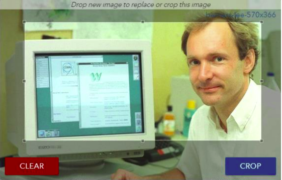

Tombol “CLEAR” untuk membatal foto tersebut.
Tombol “CROP” untuk meng-crop foto tersebut.

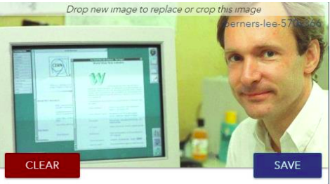
Kemudian klik “SAVE” untuk menyimpan foto tersebut.

## Profil Pasien

Klik foto pasien untuk membuka data pasien yang telah terdaftar, kemudian akan
dialihkan kehalaman data pasien. Di halaman ini terdapat 4 buah tab.

Tab “PROFILE PATIENT” , “PATIENT CONTACT”, dan “PATIENT
PAYMENT”, ketiga tab ini untuk melihat data pasien, jika salah satu data diubah maka
akan muncul tombol “UPDATE” untuk mengubah data tersebut. Tab “MEDICAL
REPORT” untu melihat data hasil medical (General Checkup, Imanging, Laboratory).

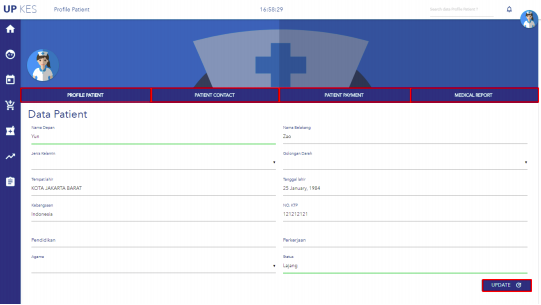

