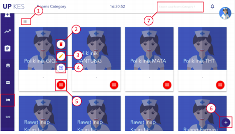
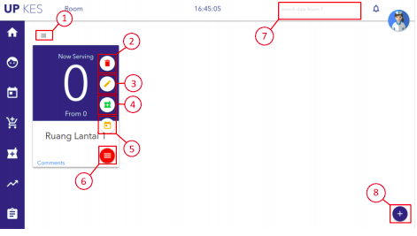
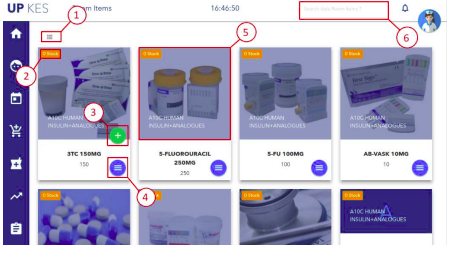
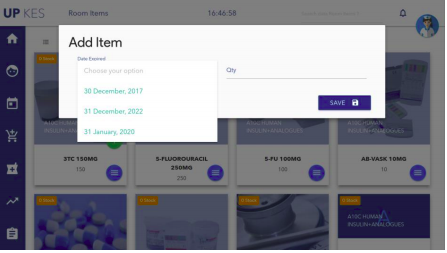

# Room

Keterangan :
1. Tombol untuk mengganti tampilan ( tabel atau kartu ) data.
2. Tombol untuk menghapus kategori ruangan.
3. Tombol untuk mengubah kategori ruangan.
4. Tombol untuk melihat/mengatur ruangan berdasarkan kategori tersebut.
5. Tombol untuk menampilkan/menyembunyikan ke lima tombol di atas (2, 3, dan 4).
6. Tombol untuk menambahkan katagori ruangan.
7. Textbox untuk mecari kategori ruangan, bedasarkan nama kategori.

Pada menu Room/Ruangan dikelompokan berdasarkan kategori ruangan, jadi di
halaman pertama terdapat kategori ruangan seperti gambar dia atas, kemudian klik tombol
“PANAH KANAN” yang berwarna biru untuk melihat/mengatur ruangan dikategori
tersebut, seperti gambar di bawah ini

Keterangan :
1. Tombol untuk mengganti tampilan ( tabel atau kartu ) data.
2. Tombol untuk menghapus ruangan.
3. Tombol untuk mengubah ruangan.
4. Tombol untuk melihat dan mengatur stok obat di ruang tersebut.
5. Tombol untuk melihat jadwal dokter di ruang tersebut.
6. Tombol untuk menampilkan/menyembunyikan ke lima tombol di atas (2, 3, 4,
dan 5).
7. Textbox untuk mecari ruangan, bedasarkan nama ruang.
8. Tombol untuk menambah ruangan.

## Menambah Stok Ruangan

Untuk menambah stok di ruangan, langkah pertama klik tombol “+ Penumbuk
Obat” yang berwarna hijau, kemudian akan dialihakan ke halaman Room Item seperti
gambar di bawah ini.

Keterangan :
1. Tombol untuk mengganti tampilan ( tabel atau kartu ) data.
2. Jumlah stok yang tersedia di ruangan tersebut.
3. Tombol untuk menambah stok di ruangan tersebut.
4. Tombol untuk menampilkan/menyembunyikan tombol “+” yang bewarna hijau.
5. Klik foto item untuk melihat detail stok di ruangan tersebut.
6. Textbox untuk mecari Item, bedasarkan nama Item.

Selajutnya klik tombol “+” yang berwarna hijau di salah satu obat yang ingin di
masukan ke dalam ruangan tersebut, maka akan muncul form seperti gambar di bawah ini.
Kemudian pilih Expaired Date ( akan muncul di Gudang ada. ), masukan quantity obat
tersebut ( qty tidak bias melebihi stok yang tersedia di Gudang/warehouse ). Kemudian
klik “SAVE”, maka stok yang ada di Gudang akan berpindah ke ruangan tersebut.

