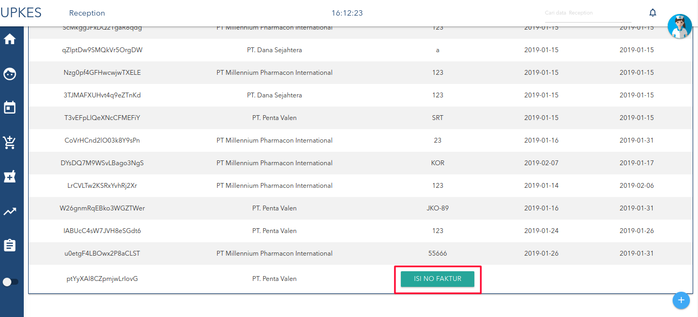
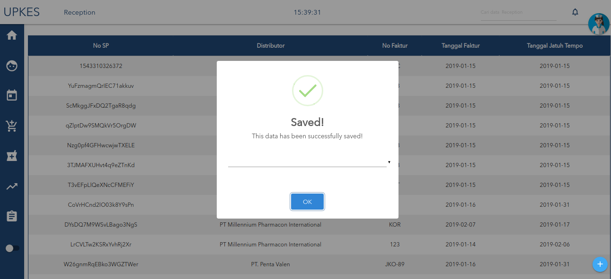

#isi no faktur(kelanjutan dari yang sebelumnya)

pertama klik tombol **"isi nofaktur"**.

isi semua form yang kosong,setelah itu klik tombol berikutnya.

lalu edit data yang terlebih dahulu diisi di Tutorial 3.

setelah diedit klik tombol yang diberi tanda merah.

selanjutnya klik tombol simpan yang di beri tanda merah

setelah itu anda akan mendapatkan pesan
