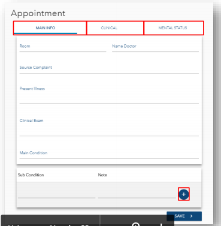
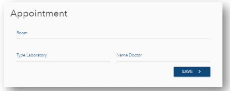

# Membuat Schedule Baru
Klik salah satu tanggal untuk membuat schedule baru. lalu akan muncul form seperti ini. 

Ketika selesai mengisi form,Klik "**save**" akan muncul form lagi sesuai Type Appointment.

* General checkup
    
    pada type Generalcheckup terdapat 3 tab untuk mengisi data sesuai judul tab tersebut.Di tab "**MAIN INFO**" terdapat bidang sub condition,bidang tersebut biasa diisi lebih dari 1 data,dengan cara klk tombol "**+**" untuk menambah kondisi lain.
    

    * Laboratori

* imaging

Pada type imaging tedapat satu tombol "**+**"  untuk menggugah gambar akan muncul pada form seperti gambar dibawah.Setelah selesai mengisi form kemudian klik tombol "UPLOAD IMAGE" untuk memilih gambar hasil rontgen tersebut.
 
setelah mengisi form sesuai type appointment kemudian klik "**save**"