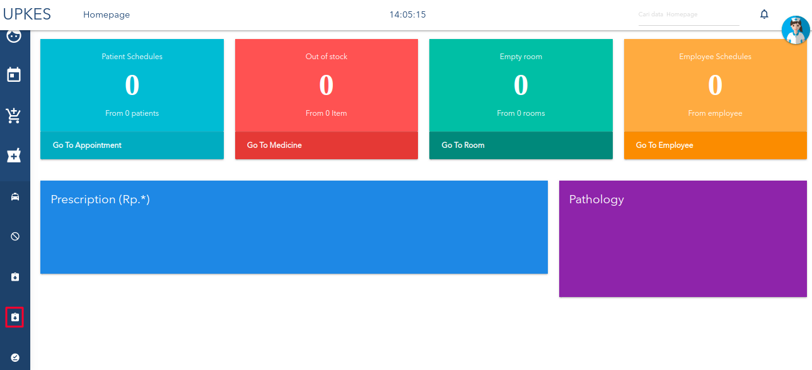
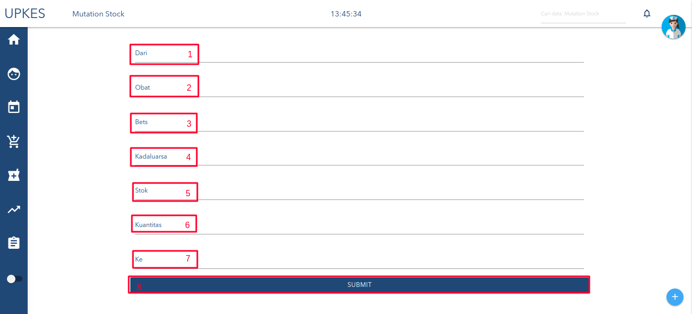

# MUTASI STOK
1. klik tombol mutasi stok yang diberi tanda,seperti berikut.
    
2. setelah masuk kehalaman Mutasi stok,seperti berikut.

 * Keterangan :
    1. piilih ruangan awal mula obat.
     2.  pilih obat yang akan dipindahkan(obat yang diisi tergantung pada ruangan yang dipilih).
     3. kode obat. 
     4. kadaluarsa obat yang dipilih.
     5. stok obat.
     6. obat yang diterima dari pemasok.
     7. ruangan  yang dipilih untuk memindahkan obat.
     8. tombol simpan.
3. selesai. 