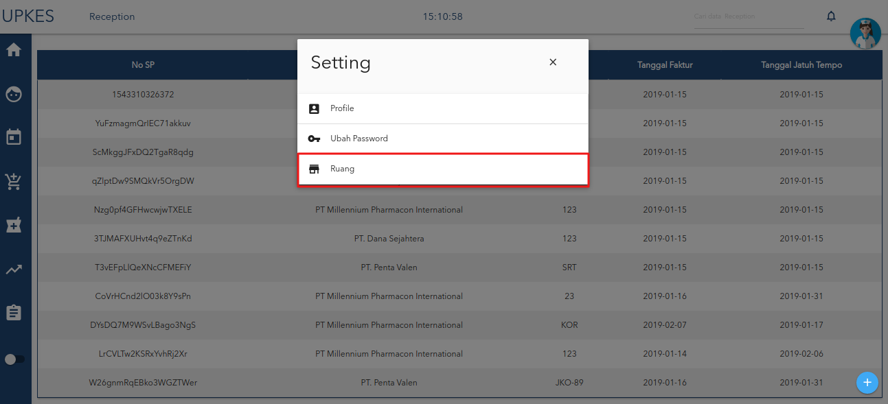

# isi nama supplier dan no faktur

1. klik tombol tambah yang berada di pojok bawah kanan.

2. sebelum anda harus memilih ruang 

3. isi semua form yang kosong.

4. lalu klik tombol berikutnya.

5. isi tlg faktur dan tgl jatuh tempo.

6. isi semua form yang kosong lalu klik tombol tambah **(+)**.

7. setelah seluruh form terisi maka akan maksud pada table yang ada sebelah kanan

8. jika ingin mengedit klik data yang akan diedit.

9. jika selesai mengedit klik tombol edit **gambar pensil**.

10. jika sudah selesaiu klik tombol tambah.

11. jika sudah di klik akan muncul pesan
