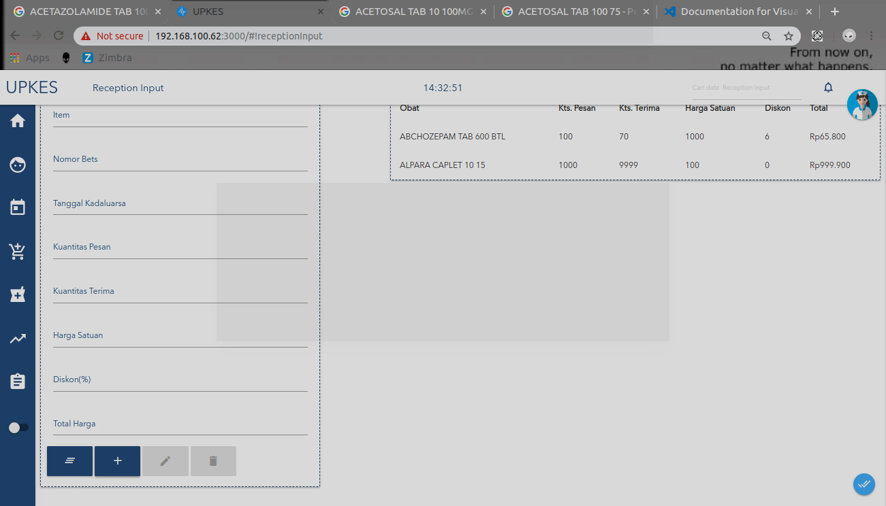

* **stok awal**

1. pertama masuk kehalaman home.
    

2. kedua pilih menu penerimaan.
    
3. setelah masuk ke halaman penerimaan, pilih menu yang lambang tambah **(+)**,
 
 4. sebelum  memnambahkan itm di perlukan ruang penyimpanan. 
    * pertama klik tombol perawat.
    

    * pilih penganturan akun.
    

    * lalu pilih ruang.
    

    * pilih salah satu ruang
    
4. Dalam  menambahkan stok ada 4 cara 
   *cara pertama
    * pertama dengan memilih tombol stok awal.
    
    * setelah masuk halaman isi semua inputan.

    * setelan diisi lalu klik tombol tambah,semua inputan akan maksud pada table disamping.
    

    * jika ingin mengedit data yang telah,klik yang akan diedit maka yang akan diedit akan masuk inputan awal
    

    * setelah diedit klik tombol edit atau logo pensil.
    
    * jika ingin menambah data isi kembali semua inputan lalu klik tombol tambah.
    
    * setelan klik tombol tambah maka semua inputan akan pada table
    

    * jika sudah selesai klik tombol ceklis.
    
    * setelah itu maka akan data pesan.
    
    * maka akn muncul pada halaman penerimaan.
    

  

