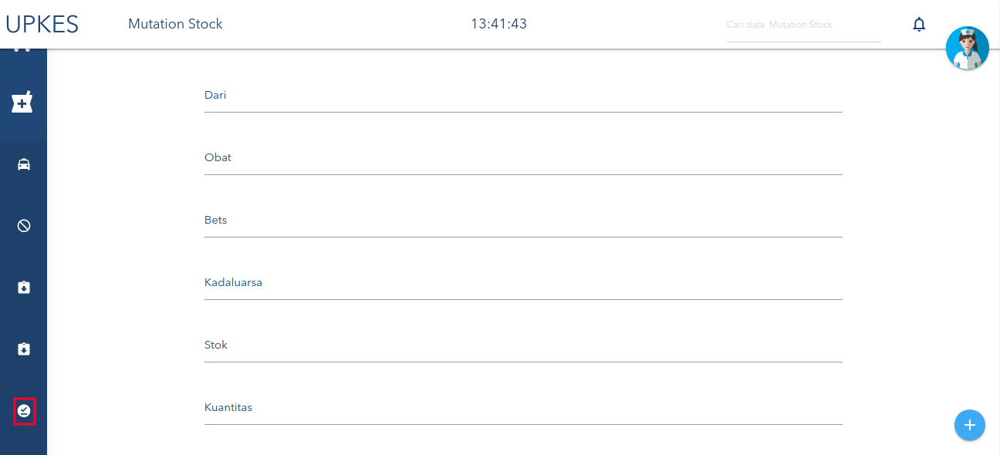
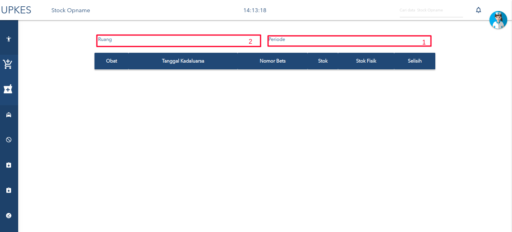
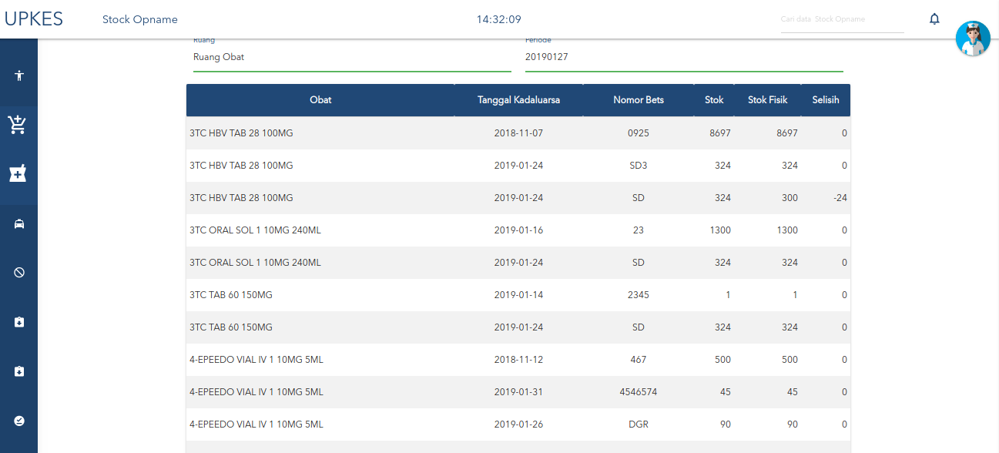
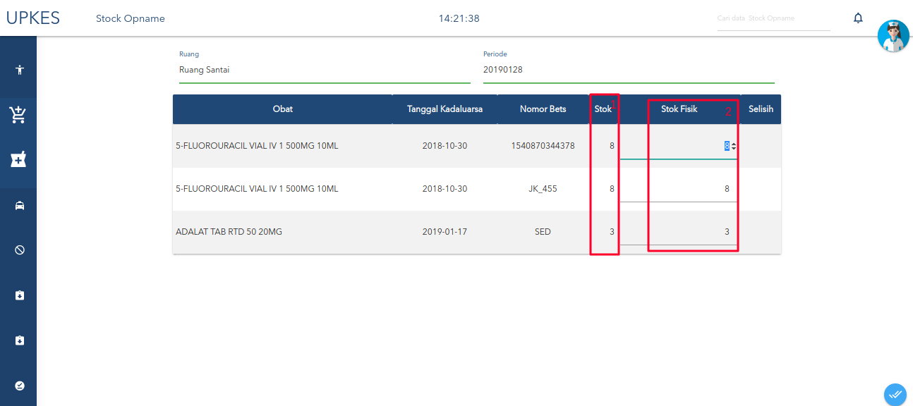
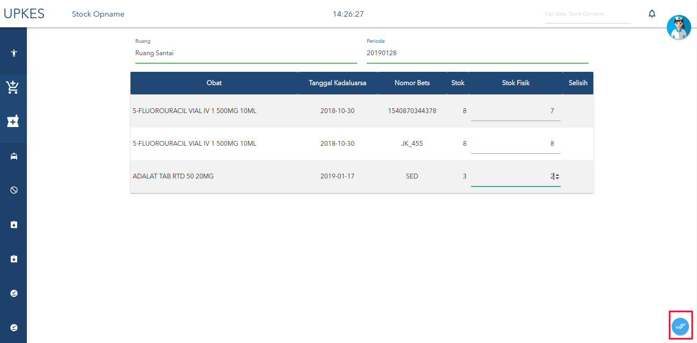
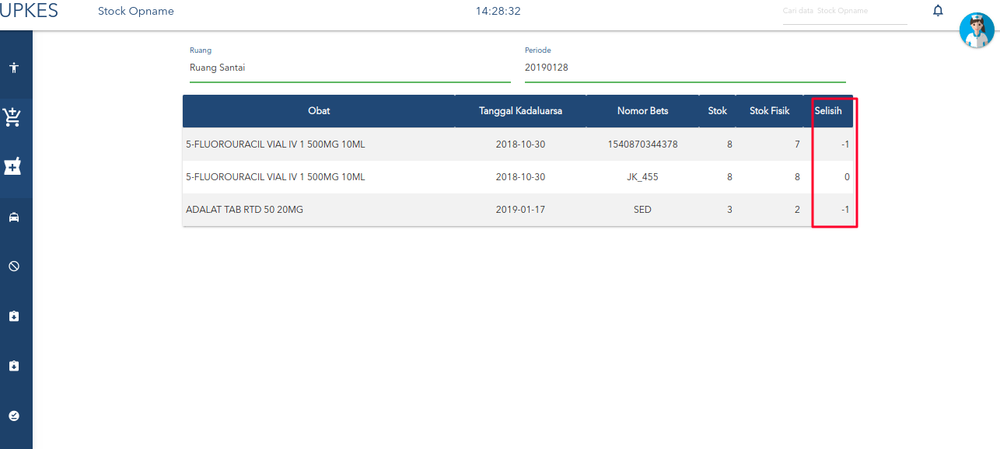

# STOK UPNAME

1. klik menu yang diberi tanda,seperti berikut.

2. setelah masuk halaman akan seperti berikut.
S
        * keterangan :
    1. tanggal hanya bisa hari ini saja.
    2. pilih ruangan.
    3. jika tanggal diisi tanggal bukan hari ini maka akan seperti berikut.
    
        keterangan : data berbentuk seperti laporan.
3. setelah memilih  ruang dan periode akan ada table seperti berikut.

        * keterangan :
    1. stok awal.
    2. stok akhir.
4. setelah itu  klik tombol ceklis yang berada di bawah kanan pojok,seperti gambar berikut.

5. setelah klik tombol ceklis maka selisih pada table akan muncul secara otomatis,dimana stok berbeda dengan stok fisik.

6. selesai.