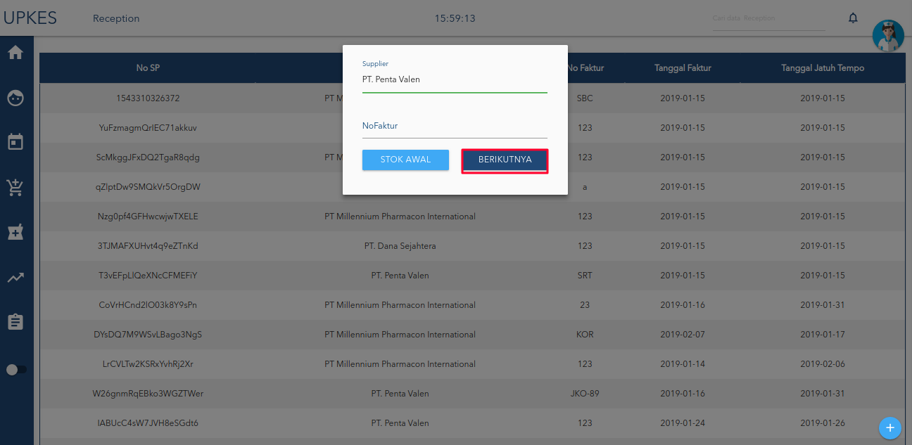

# isi supplier/distributor

 Isi form Supplier lalu klik tombol berikut.

klik tombol tambah jika sudah mengisi form.

setelah disimpan akan masuk kedalam table, jika ingin di edit pilih data yang akan diedit.

ketika selesai mengedit klik tombol yang bertanda merah seperti gambar di bawah

klik tombol simpan maka akan muncul pesan

